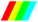
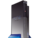

# 👋 ¡Hola, soy Scorpio21!

🎮 Apasionado por el desarrollo de juegos, fan de Argentum Online, y entusiasta del software retro.  
Estoy constantemente aprendiendo y experimentando con nuevas tecnologías.

---

<!-- POKEMON_INFO -->
<!-- Generated: 2026-08-06T11:11:42.631051+00:00 -->

  

---

<table width="100%">

<tr>
<td colspan="2" align="center">

<table>
<tr>

<td align="center">
<b>Normal</b> 

</td>

<td width="40"></td>

<td align="center">
<b>✨ Shiny</b> 

</td>

</tr>
</table>

</td>
</tr>

<tr>
<td colspan="2" align="center">

</td>
</tr>

<tr>
<td colspan="2"><h3>📋 Información General</h3></td>
</tr>

<tr>
<td style="white-space: nowrap;"><b>Nombre</b></td>
<td>🔵 <b>Qwilfish</b></td>
</tr>

<tr>
<td style="white-space: nowrap;"><b>🇯🇵 Nombre original</b></td>
<td>ハリーセン</td>
</tr>

<tr>
<td style="white-space: nowrap;"><b>🧬 Especie</b></td>
<td>Pokémon Qwilfish</td>
</tr>

<tr>
<td style="white-space: nowrap;"><b>Rareza</b></td>
<td>

</td>
</tr>

<tr>
<td style="white-space: nowrap;"><b>Nº Pokédex</b></td>
<td>#211</td>
</tr>

<tr>
<td style="white-space: nowrap;"><b>🧬 Generación</b></td>
<td>II (Johto)  <small>📅 1999</small></td>
</tr>

<tr>
<td style="white-space: nowrap;"><b>🗺️ Región</b></td>
<td>🏝️ Johto</td>
</tr>

<tr>
<td style="white-space: nowrap;"><b>🎮 Juego debut</b></td>
<td>Pokémon Oro / Plata</td>
</tr>

<tr>
<td style="white-space: nowrap;"><b>🎵 Música</b></td>
<td>
<a href="https://www.youtube.com/results?search_query=Pokemon+Gold+Silver+Wild+Pokemon+Theme" target="_blank">
🎧 Escuchar en YouTube
</a>
</td>
</tr>

<tr>
<td style="white-space: nowrap;"><b>Tipo(s)</b></td>
<td>&nbsp;&nbsp;&nbsp;&nbsp;</td>
</tr>

<tr>
<td colspan="2"><h3>🧬 Biología</h3></td>
</tr>

<tr>
<td style="white-space: nowrap;"><b>Clase</b></td>
<td>Globo</td>
</tr>

<tr>
<td style="white-space: nowrap;"><b>⭐ Legendario</b></td>
<td>

</td>
</tr>

<tr>
<td style="white-space: nowrap;"><b>🌟 Mítico</b></td>
<td>

</td>
</tr>

<tr>
<td style="white-space: nowrap;"><b>👶 Bebé</b></td>
<td>

</td>
</tr>

<tr>
<td style="white-space: nowrap;"><b>🌍 Forma regional</b></td>
<td>

</td>
</tr>

<tr>
<td style="white-space: nowrap;"><b>🎨 Color</b></td>
<td></td>
</tr>

<tr>
<td style="white-space: nowrap;"><b>📏 Altura</b></td>
<td>0.5 m</td>
</tr>

<tr>
<td style="white-space: nowrap;"><b>⚖️ Peso</b></td>
<td>3.9 kg</td>
</tr>

<tr>
<td style="white-space: nowrap;"><b>♂️ / ♀️</b></td>
<td>♂️ 50.0% &nbsp;&nbsp;&nbsp; ♀️ 50.0%</td>
</tr>

<tr>
<td style="white-space: nowrap;"><b>🌍 Hábitat</b></td>
<td>🌊 Mar</td>
</tr>

<tr>
<td style="white-space: nowrap;"><b>🥚 Grupo huevo</b></td>
<td>Agua 2</td>
</tr>

<tr>
<td style="white-space: nowrap;"><b>❤️ Amistad base</b></td>
<td>
70 
❤️🤍🤍🤍🤍
</td>
</tr>

<tr>
<td colspan="2"><h3>⚔️ Combate</h3></td>
</tr>

<tr>
<td style="white-space: nowrap;"><b>⚔️ Débil contra</b></td>
<td>&nbsp;&nbsp;&nbsp;&nbsp;&nbsp;&nbsp;&nbsp;&nbsp;</td>
</tr>

<tr>
<td style="white-space: nowrap;"><b>🛡️ Resiste</b></td>
<td>&nbsp;&nbsp;&nbsp;&nbsp;&nbsp;&nbsp;&nbsp;&nbsp;&nbsp;&nbsp;&nbsp;&nbsp;&nbsp;&nbsp;&nbsp;&nbsp;&nbsp;&nbsp;</td>
</tr>

<tr>
<td style="white-space: nowrap;"><b>✨ Inmune a</b></td>
<td>Ninguna</td>
</tr>

<tr>
<td style="white-space: nowrap;"><b>🎯 Captura</b></td>
<td>
 
🟩🟩⬜⬜⬜⬜⬜⬜⬜⬜ 
17.6%
</td>
</tr>

<tr>
<td style="white-space: nowrap;"><b>🎲 Ratio captura</b></td>
<td>45</td>
</tr>

<tr>
<td style="white-space: nowrap;"><b>✨ Probabilidad Shiny</b></td>
<td>1 entre 4096</td>
</tr>

<tr>
<td style="white-space: nowrap;"><b>💪 Habilidades</b></td>
<td>🟢 ⚡ <b>Punto Tóxico</b> <small>Has a 30% chance of poisoning attacking Pokémon on contact.</small>  🟢 ⚡ <b>Nado Rápido</b> <small>Doubles Speed during rain.</small>  ⭐ ✨ <b>Intimidación</b> (Oculta) <small>Lowers opponents' Attack one stage upon entering battle.</small></td>
</tr>

<tr>
<td style="white-space: nowrap;"><b>📦 Objetos</b></td>
<td> <b>Poison Barb</b> (5%)  <b>Poison Barb</b> (100%)</td>
</tr>

<tr>
<td style="white-space: nowrap;"><b>🥊 Movimientos</b></td>
<td>   </td>
</tr>

<tr>
<td style="white-space: nowrap;"><b>🔄 Evolución</b></td>
<td>
<table align="center">
<tr>

<td align="center" valign="top">

<table align="center" cellspacing="0" cellpadding="0">
<tr>
<td
align="center"
width="78"
height="78"
style="
background:#98C2D1;
border:2px solid #492A49;
border-radius:50%;
">

</td>
</tr>
</table>

<b style="font-size:15px;color:#000;">
Qwilfish
</b>

 

<small style="
color:#555;
font-weight:bold;
">
#0211
</small>

  

&nbsp;&nbsp;&nbsp;&nbsp;

</td>

<td align="center" valign="middle" style="width:auto; padding:10px;">

Evoluciona

➜

</td>

<td align="center" valign="top">

<table align="center" cellspacing="0" cellpadding="0">
<tr>
<td
align="center"
width="78"
height="78"
style="
background:#98C2D1;
border:2px solid #492A49;
border-radius:50%;
">

</td>
</tr>
</table>

<b style="font-size:15px;color:#000;">
Overqwil
</b>

 

<small style="
color:#555;
font-weight:bold;
">
#0904
</small>

  

&nbsp;&nbsp;&nbsp;&nbsp;

</td>

</tr>
</table>
</td>
</tr>

<tr>
<td style="white-space: nowrap;"><b>🎮 Juegos</b></td>
<td>     </td>
</tr>

<tr>
<td colspan="2"><h3>📊 Estadísticas</h3></td>
</tr>

<tr>
<td style="white-space: nowrap;"><b>⭐ Experiencia Base</b></td>
<td>88</td>
</tr>

<tr>
<td><b>📈 Nivel 100</b></td>
<td>
💠 <b>1.000.000 XP</b>
</td>
</tr>

<tr>
<td style="white-space: nowrap;"><b>📚 Crecimiento</b></td>
<td></td>
</tr>

<tr>
<td style="white-space: nowrap;"><b>🏆 Poder Total (BST)</b></td>
<td>
🟦🟦🟦🟦🟦🟦🟦🟦🟦🟦🟦🟦⬜⬜⬜⬜⬜⬜⬜⬜

<b>440 puntos</b> 
⚔️ Fuerte
</td>
</tr>

<tr>
<td style="white-space: nowrap;">
<b style="white-space: nowrap;">📊 Estadísticas Base</b>
</td>
<td>❤️ PS 65 
    🟧🟧🟧⬜⬜⬜⬜⬜⬜⬜ 
    ⚔️ Ataque 95 
    🟨🟨🟨🟨⬜⬜⬜⬜⬜⬜ 
    🛡️ Defensa 85 
    🟨🟨🟨⬜⬜⬜⬜⬜⬜⬜ 
    ✨ At. Especial 55 
    🟧🟧⬜⬜⬜⬜⬜⬜⬜⬜ 
    🛡️ Def. Especial 55 
    🟧🟧⬜⬜⬜⬜⬜⬜⬜⬜ 
    💨 Velocidad 85 
    🟨🟨🟨⬜⬜⬜⬜⬜⬜⬜
    

🏆 <b>Total Base:</b> 440 
🥇 <b>Mejor atributo:</b> ⚔️ Ataque (95) 
🥉 <b>Atributo más bajo:</b> ✨ At. Especial (55)</td>

<tr>
<td style="white-space: nowrap;"><b>📈 Perfil competitivo</b></td>
<td>
    🏆 <b>Poder total</b>: ⭐⭐⭐⭐⭐ 
    ⚔️ <b>Ataque</b>: ⭐⭐⭐☆☆ 
    🛡️ <b>Defensa</b>: ⭐⭐☆☆☆ 
    ✨ <b>At. Especial</b>: ⭐☆☆☆☆ 
    🛡️ <b>Def. Especial</b>: ⭐☆☆☆☆ 
    💨 <b>Velocidad</b>: ⭐⭐☆☆☆
    </td>
</tr>

</table>

---

## 🎮 Pokémon GO

🏆 **PC máximo (Nivel 50):** 2182

⚔️ **Ataque:** 184

🛡️ **Defensa:** 138

❤️ **Resistencia:** 163

🏷️ **Tipos:** &nbsp;&nbsp;&nbsp;&nbsp;

---

### ⚡ Ataques rápidos

 ⚔️5 ⚡5 ⏱️0.5s  ⚔️4 ⚡6 ⏱️0.5s

---

### 💥 Ataques cargados

 ⚔️105 ⚡100 ⏱️3.0s  ⚔️95 ⚡50 ⏱️3.5s  ⚔️75 ⚡50 ⏱️3.5s  ⚔️50 ⚡33 ⏱️2.0s  ⚔️45 ⚡33 ⏱️2.0s  ⚔️20 ⚡50 ⏱️3.0s

---

## 💡 Curiosidad oficial

<table>
<tr>
<td>

    💬 Para arrojar sus venenosas púas, infla su cuerpo bebiendo hasta diez litros de agua de una sola vez.

    🎮 Juego de debut: Pokémon Oro / Plata

    🌍 Región: Johto
    

</td>
</tr>
</table>

---

## 💡 Datos interesantes

<table width="100%">
<tr>
<td>

🎯 Ratio de captura: 45. ❤️ Amistad base: 70. 📏 Mide 0.5 m.

</td>
</tr>
</table>

---

⭐ Datos oficiales obtenidos de <b>PokéAPI</b> 
🤖 Generado automáticamente con Python 
🗓️ Última actualización: <b>2026-08-06</b>

<!-- END_POKEMON_INFO -->

<!-- FRASE_GAMER -->
<!-- Generated: 2026-08-06T11:11:42.631051+00:00 -->

---

## 💬 Frase Gamer del día

> *"Gamer de día, héroe de noche."*

<!-- END_FRASE_GAMER -->

---

## 🕹️ Tecnologías retro favoritas

  
  
  
  

---

## 💻 Tecnologías que uso frecuentemente

### 🧠 Skills principales

| Lenguaje / Tecnología | Nivel |
|------------------------|-------|
|  Visual Basic 6.0 |  |
|  PHP |  |
|  MySQL |  |
|  HTML |  |
|  CSS |  |
|  JavaScript |  |

---

### 📌 Proyectos destacados

| Proyecto | Descripción | Tecnologías | Enlace |
|---------|-------------|-------------|--------|
| 🎮 **Argentum Online Revival** | Versión mejorada del clásico AO con nuevas funciones, correcciones de bugs y soporte para sistemas modernos. |   | [🔗 Ver en GitHub](https://github.com/scorpio21/argentum-online-revival) |
| 🧙 **AO Spell Editor** | Editor de hechizos para AO con interfaz intuitiva y exportación automática. |   | [🔗 Ver en GitHub](https://github.com/scorpio21/ao-spell-editor) |
| 📊 **ZX Spectrum Game Extractor** | Script en Python para extraer juegos del archivo HTML del World of Spectrum y exportarlos a Excel. |   | [🔗 Ver en GitHub](https://github.com/scorpio21/zx-spectrum-extractor) |

---

## 📬 ¿Querés contactarme?

  
  

---

  

<!-- Última actualización: 2025-04-11T12:34:02.223425 -->
